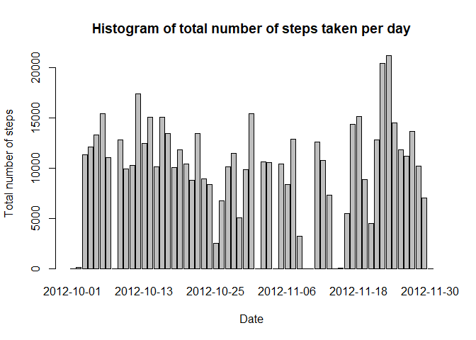
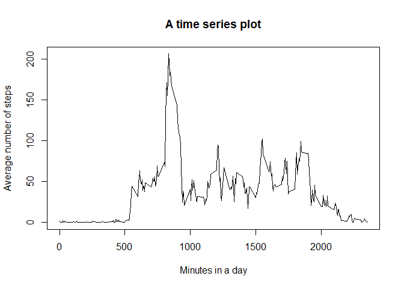
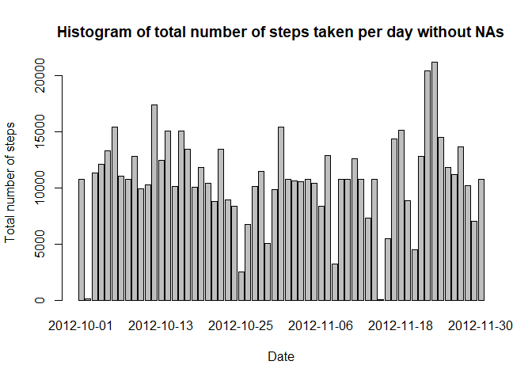
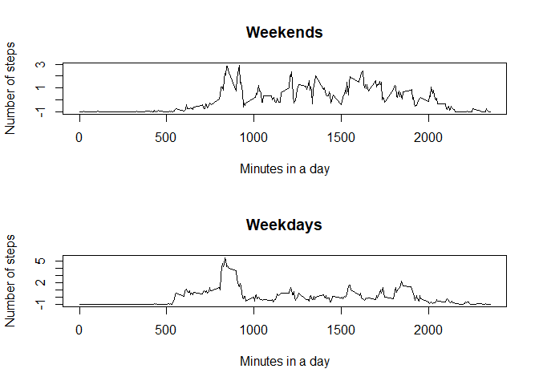

## Loading and preprocessing the data

This assignment makes use of data from a personal activity monitoring device. This device collects data at 5 minute intervals through out the day. The data consists of two months of data from an anonymous individual collected during the months of October and November, 2012 and include the number of steps taken in 5 minute intervals each day.

We process the variable *date* into a *Date* format **%Y-%m-%d**

```r
data <- read.csv("activity.csv")

data$date <- as.Date(data$date, "%Y-%m-%d")
summary(data)
```

```
##      steps             date               interval     
##  Min.   :  0.00   Min.   :2012-10-01   Min.   :   0.0  
##  1st Qu.:  0.00   1st Qu.:2012-10-16   1st Qu.: 588.8  
##  Median :  0.00   Median :2012-10-31   Median :1177.5  
##  Mean   : 37.38   Mean   :2012-10-31   Mean   :1177.5  
##  3rd Qu.: 12.00   3rd Qu.:2012-11-15   3rd Qu.:1766.2  
##  Max.   :806.00   Max.   :2012-11-30   Max.   :2355.0  
##  NA's   :2304
```

##  Mean total number of steps taken per day

For this part of the assignment, we ignore the missing values in the dataset. First we calculate the total number of steps taken per day - variable *steps_total_day*. Then we make a histogram of the total number of steps taken each day. 


```r
steps_total_day <- tapply(data$steps, as.factor(data$date), sum, na.rm = T)
barplot(steps_total_day, xlab = "Date", ylab = "Total number of steps", main = "Histogram of total number of steps taken per day")
```

<!-- -->

```r
steps_mean <- mean(steps_total_day, na.rm = T)
steps_median <- median(steps_total_day, na.rm = T)
```

The mean and median of the total number of steps taken per day are mean = 9354.2295082 and median = 10395.

## The average daily activity pattern

We make a time series plot of the 5-minute interval (x-axis) and the average number of steps taken, averaged across all days (y-axis).


```r
steps_interval <- tapply(data$steps, as.factor(data$interval), mean, na.rm = T)
plot(names(steps_interval), steps_interval, type = "l", main = "A time series plot", xlab = "Minutes in a day", ylab = "Average number of steps")
```

<!-- -->

```r
max_interval <- names(which.max(steps_interval))
```
The **835** 5-minute interval, on average across all the days in the dataset, contains the maximum number of steps.

## Imputing missing values

```r
b <- data[!complete.cases(data), ]
len <- nrow(b)
```
The total number of missing values in the dataset is 2304.

TO fill in all of the missing values in the dataset we use the mean for that 5-minute interval. As a result a new dataset that is equal to the original dataset but with the missing data filled in was created.


```r
library(dplyr)
```

```
## 
## Attaching package: 'dplyr'
```

```
## The following objects are masked from 'package:stats':
## 
##     filter, lag
```

```
## The following objects are masked from 'package:base':
## 
##     intersect, setdiff, setequal, union
```

```r
data_1<- data %>%
  group_by(interval) %>%
 mutate(mean = mean(steps, na.rm = T)) %>%
  ungroup()
NAindex <- is.na(data$steps)
data_1$steps<- replace(data_1$steps,NAindex, data_1$mean)
```

```
## Warning in x[list] <- values: number of items to replace is not a multiple of
## replacement length
```

```r
summary(data_1$steps)
```

```
##    Min. 1st Qu.  Median    Mean 3rd Qu.    Max. 
##    0.00    0.00    0.00   37.38   27.00  806.00
```
A histogram of the total number of steps taken each day is shown below.

```r
steps_1_total_day <- tapply(data_1$steps, as.factor(data_1$date), sum, na.rm = T)
barplot(steps_1_total_day, xlab = "Date", ylab = "Total number of steps", main = "Histogram of total number of steps taken per day without NAs")
```

<!-- -->

```r
steps_mean_1 <- mean(steps_1_total_day)
steps_median_1 <- median(steps_1_total_day)
```

The mean and median total number of steps taken per day are 1.0766189\times 10^{4} and 1.0766189\times 10^{4}. 
These values differ from the estimates from the first part of the assignment. They are changed, because the NAs were replaced based on the interval means, the mean and the median for the day now match up.

## Differences in activity patterns between weekdays and weekends

First we create a new factor variable *day* in the dataset with two levels – “weekday” and “weekend” indicating whether a given date is a weekday or weekend day.

```r
data_1 <- mutate(data_1, day = weekdays(data_1$date))
weekdays <- c('Monday', 'Tuesday', 'Wednesday', 'Thursday', 'Friday')

data_1$day <- factor(data_1$day %in% weekdays, 
                       levels=c(FALSE, TRUE), labels=c('Weekend', 'Weekday'))
```

A panel plot containing a time series plot of the 5-minute interval (x-axis) and the average number of steps taken, averaged across all weekday days or weekend days (y-axis) is shown below.


```r
weekdays <- subset(data_1, day == "Weekday")
weekends <- subset(data_1, day == "Weekend")

weekendmeans <- with(weekends, tapply(steps, interval, mean))
weekendmean <- mean(weekendmeans)
weekendmeans <- (weekendmeans - weekendmean)/weekendmean

weekdaymeans <- with(weekdays, tapply(steps, interval, mean))
weekdaymean <- mean(weekdaymeans)
weekdaymeans <- (weekdaymeans - weekdaymean)/weekdaymean

par(mfrow = c(2,1))
plot(names(weekendmeans), weekendmeans, type = "l", main = "Weekends", xlab = "Minutes in a day", ylab = "Number of steps")
plot(names(weekdaymeans), weekdaymeans, type = "l", main = "Weekdays", xlab = "Minutes in a day", ylab = "Number of steps")
```

<!-- -->
